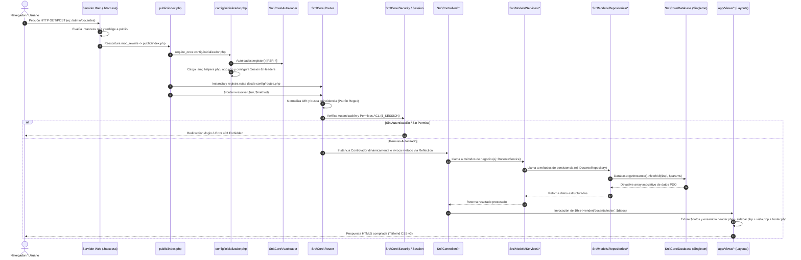

# Informe Técnico de Arquitectura y Flujo de Ejecución del Sistema SGCEA

## Resumen Ejecutivo

El **Sistema de Gestión del Centro Educativo y Académico (SGCEA)** está construido sobre una arquitectura personalizada en PHP 8.3 implementando el patrón **Modelo-Vista-Controlador (MVC)**, enriquecido con la arquitectura en capas **Service-Repository** para desvincular la lógica de negocio del acceso a la base de datos.

La aplicación utiliza un enfoque **Front Controller** donde todas las peticiones dinámicas son canalizadas a través de `public/index.php`. No depende de frameworks pesados de terceros, sino de un núcleo ligero y altamente eficiente desarrollado a la medida (`Src\Core`), respaldado por un **Autoloader PSR-4 personalizado**, un enrutador inteligente con control de acceso basado en roles y permisos (**ACL**), y mecanismos nativos de seguridad (protección **CSRF**, sanitización, headers HTTP restrictivos y rate limiting).

---

## Diagrama de Flujo del Ciclo de Vida de una Petición HTTP

El siguiente diagrama ilustra el recorrido completo desde que el usuario realiza una solicitud en el navegador hasta que la aplicación renderiza y retorna la respuesta HTML o JSON:



---

## Análisis Detallado por Capas

### 1. El Punto de Entrada (Front Controller)

El patrón **Front Controller** centraliza el manejo de todas las peticiones en un único archivo. En SGCEA, este proceso involucra la colaboración de tres archivos principales:

1. **`.htaccess` (Raíz del proyecto):**
   - Habilita `mod_rewrite`.
   - Permite que si la petición solicita un archivo o directorio físico existente en la raíz (como la Landing Page estática `index.html`), se sirva directamente.
   - De lo contrario, redirige el tráfico hacia la carpeta `public/`.
   - Bloquea el acceso público a archivos sensibles (`.env`, `database.sql`, `seed.sql`, `.git`).

2. **`public/.htaccess` (Reescritura interna):**
   - Configura la regla `RewriteRule ^(.*)$ index.php [QSA,L]`. Si la petición no es un archivo o directorio físico dentro de `public/assets/`, se redirige internamente a `public/index.php` pasando los parámetros Query String.
   - Deshabilita el listado de directorios (`Options -Indexes`).

3. **`public/index.php` (Front Controller):**
   - Es el punto de inicio de la ejecución PHP.
   - Carga el archivo de arranque `config/inicializador.php`.
   - Encapsula la ejecución principal en un bloque `try...catch` global. Si ocurre una excepción no capturada, valida si la constante `APP_DEBUG` está activa para mostrar el stack trace detallado o renderizar la vista de error de producción `app/Views/errors/500.php`.
   - Instancia el `Router`, lee el mapeo de rutas de `config/routes.php`, las registra y ejecuta `$router->resolver($_SERVER['REQUEST_URI'], $_SERVER['REQUEST_METHOD'])`.

4. **Bootstrap (`config/inicializador.php`):**
   - **Rutas base dinámicas:** Calcula de manera adaptativa la constante `BASE_PATH` comparando `REQUEST_URI` y `SCRIPT_NAME` (soporta ejecución en subdirectorios como `/sgcea`, `/sgcea/public` o la raíz `/`).
   - **Inicialización del Autoloader:** Carga `core/Autoloader.php` y ejecuta `Autoloader::register()`.
   - **Entorno y Helpers:** Invoca `Src\Core\Env::cargar()` para parsear el archivo `.env` y requiere `core/helpers.php`.
   - **Configuración Global:** Carga `config/app.php` y establece la zona horaria (`America/Caracas`).
   - **Sesiones Securizadas:** Inicia la sesión PHP aplicando directivas estrictas de seguridad (`cookie_httponly`, `use_only_cookies`, `cookie_samesite=Lax`, tiempo de vida de 1 hora) y asigna un directorio de almacenamiento aislado (`storage/sessions`).
   - **Headers de Seguridad:** Invoca `Src\Core\Security::establecerHeadersSeguridad()`.

---

### 2. Enrutamiento (Routing)

El sistema de enrutamiento está gestionado por `Src\Core\Router` (`core/Router.php`) y configurado de forma declarativa en `config/routes.php`.

#### Definición de Rutas (`config/routes.php`)
Retorna un array multidimensional clasificado por método HTTP (`GET` y `POST`). Cada entrada mapea un patrón URI a una tupla conteniendo la acción `Controlador@método` y la clave del permiso ACL requerido:

```php
'GET' => [
    '/admin/estudiantes' => ['AdminController@listarEstudiantes', 'admin.estudiantes.ver'],
    '/admin/estudiantes/editar/{id}' => ['AdminController@mostrarEditarEstudiante', 'admin.estudiantes.editar'],
]
```

#### Lógica de `Router::resolver()`
1. **Limpieza de URI:** Utiliza `parse_url()` para remover query strings (`?param=value`) y elimina dinámicamente los prefijos de subdirectorios (`/sgcea`, `/sgcea/public`).
2. **Redirección por defecto de Raíz `/`:** Si la URI es `/` o `/index.php`, verifica la sesión. Si el usuario está autenticado, lo redirige a su dashboard correspondiente según su rol (`/admin`, `/docente`, `/estudiante`). Si no está autenticado, redirige a `/login`.
3. **Conversión a Expresiones Regulares (`convertirAPatron`):**
   - Transforma los parámetros dinámicos `{param}` (como `{id}`) en grupos de captura regex `([^/]+)`.
   - Compila el patrón delimitado `#^/admin/estudiantes/editar/([^/]+)$#`.
4. **Validación de Autenticación y ACL:**
   - Si la ruta requiere un permiso (`$permiso !== null`) y no hay `$_SESSION['usuario_id']`, guarda la URI solicitada en `$_SESSION['redirect_after_login']` y redirige a `/login`.
   - Invoca el método privado `tienePermiso($permiso)`. Si el usuario no posee el permiso en `$_SESSION['usuario_permisos']`, emite una respuesta HTTP 403 y renderiza `app/Views/errors/403.php`.
   - **Excepción de Superadmin:** El usuario con `usuario_id === 1` sobrepasa cualquier control ACL otorgando acceso total automático.
5. **Invocación Dinámica con Reflection (`ReflectionMethod`):**
   - Instancia la clase especificada mediante su Namespace FQCN (`Src\Controllers\AdminController`).
   - Utiliza la API de Reflection de PHP 8 (`\ReflectionMethod`) para inspeccionar los parámetros exigidos por el método del controlador y emparejarlos en orden estricto con los valores capturados en la URL.

---

### 3. Controladores (Controllers)

Los controladores actúan como coordinadores del flujo. Todos los controladores residen en `app/Controllers/` y heredan de la clase base `Src\Core\Controller` (`core/Controller.php`).

#### Flujo Interno de un Controlador
1. **Recepción:** Recibe argumentos limpios desde el Router vía Reflection.
2. **Validación y Sanitización:** Procesa los datos de formularios (`$_POST`) utilizando `Src\Core\Security::sanitizarArray()` o `Security::validarTokenCSRF()`.
3. **Instanciación de Servicios:** En su constructor o métodos, delega la lógica de negocio a la capa de Servicios (`Src\Models\Services\*`).
4. **Preparación de Respuesta:**
   - Si es una vista Web: Prepara el array `$datos` y ejecuta `$this->render('admin/estudiantes/index', $datos)`.
   - Si es una API o petición AJAX: Retorna JSON estructurado mediante `$this->json(['status' => 'success', 'data' => $resultado], 200)`.
   - Si requiere redirección: Almacena un mensaje temporal en la sesión mediante `$this->setFlash('success', 'Registro actualizado correctamente')` y ejecuta `$this->redirigir('/admin/estudiantes')`.

---

### 4. Modelos (Models: Repositories & Services)

SGCEA no utiliza el patrón Active Record tradicional (donde cada modelo extiende de una clase ORM que conoce la BD), sino el **patrón Service-Repository**, garantizando el principio de responsabilidad única (SOLID).

```
[Controlador]  --->  [Servicio (Lógica de Negocio)]  --->  [Repositorio (Consultas SQL)]  --->  [Database Singleton (PDO)]
```

#### Capa de Conexión (`Src\Core\Database`)
- Implementa el **patrón Singleton** (`getInstance()`) para mantener una única conexión activa PDO durante el ciclo de vida de la petición.
- Carga las credenciales desde `config/database.php` (respaldado por variables del archivo `.env`).
- Configura PDO con manejo estricto de excepciones (`ERRMODE_EXCEPTION`), retornos en array asociativo (`FETCH_ASSOC`) y desactivación de emulación de prepare statements para prevenir inyecciones SQL.
- Ofrece métodos helper optimizados: `query()`, `fetch()`, `fetchAll()`, `insert()`, `update()`, `delete()`.

#### Capa de Repositorios (`app/Models/Repositories/`)
- Clases especializadas (ej: `EstudianteRepository`, `CalificacionRepository`, `UsuarioRepository`).
- Tienen la responsabilidad **exclusiva** de comunicarse con la base de datos a través de `Database::getInstance()`.
- Escriben consultas SQL nativas parametrizadas con placeholders (`:id`, `:email`), ejecutando `JOINs`, agrupaciones y agregaciones de alto rendimiento.
- Retornan arreglos de datos crudos.

#### Capa de Servicios (`app/Models/Services/`)
- Clases que encapsulan las **reglas de negocio** del dominio escolar (ej: `EstudianteService`, `CalificacionService`, `UsuarioService`).
- Coordinan múltiples repositorios si es necesario (ej: `UsuarioService` interactúa con `UsuarioRepository`, `PermisoRepository` y `AuditoriaService`).
- Realizan validaciones de negocio (comprobar duplicidad de cédulas, verificar prelaciones de materias, cálculo de promedios académicos) y registran eventos en el sistema de Auditoría.

---

### 5. Vistas (Views)

Las vistas se ubican en `app/Views/` y consisten en archivos PHP limpios orientados al renderizado HTML5 interactivo con estilos en **Tailwind CSS v3** e iconos Feather.

#### El Sistema de Layouts
El método `render()` de `Src\Core\Controller` gestiona el ensamblaje de la interfaz:

```php
protected function render(string $vista, array $datos = [], bool $layout = true, bool $printLayout = false): void
{
    extract($datos); // Convierte las llaves del array en variables independientes

    if ($printLayout) {
        require __DIR__ . '/../app/Views/layouts/print.php';
    } elseif ($layout) {
        require_once __DIR__ . '/../app/Views/layouts/header.php';
        require_once __DIR__ . '/../app/Views/layouts/sidebar.php';
        require_once __DIR__ . '/../app/Views/' . $vista . '.php';
        require_once __DIR__ . '/../app/Views/layouts/footer.php';
    } else {
        require __DIR__ . '/../app/Views/' . $vista . '.php';
    }
}
```

1. **Paso de Variables:** La función `extract($datos)` transforma el array entregado por el controlador (ej: `['estudiantes' => $lista]`) en variables locales utilizables directamente en la vista (`$estudiantes`).
2. **Estructura Modular del Layout:**
   - `header.php`: Carga la cabecera HTML, las metaetiquetas, las fuentes, los estilos CSS de `public/assets/`, la barra superior y los scripts base.
   - `sidebar.php`: Renderiza el menú de navegación dinámico según el rol y los permisos del usuario activo.
   - `[vista].php`: El cuerpo específico de la página solicitada.
   - `footer.php`: Carga el cierre del documento HTML, incluye los scripts JS de `public/assets/` y ejecuta los inicializadores de componentes interactivos.
3. **Vistas de Impresión:** `print.php` provee un lienzo estilizado en blanco sin barras laterales para la generación de constancias, boletines y carnetización.

#### Helpers para Vistas
Las vistas interactúan con la capa de activos públicos (`public/assets/`) a través de helpers globales declarados en `core/helpers.php`:
- `asset('css/styles.css')`: Genera URLs absolutas o relativas hacia activos estáticos.
- `url('/admin/docentes')`: Construye rutas respetando el `BASE_PATH`.
- `e($cadena)`: Alias de `Security::e()` para escapar la salida HTML y prevenir ataques **XSS**.
- `csrf_field()`: Inserta el campo oculto `<input type="hidden" name="csrf_token" value="...">` para formularios seguros.
- `can('admin.usuarios.crear')`: Evalúa dinámicamente si el usuario puede visibilizar botones o secciones protegidas.

---

### 6. Núcleo y Helpers (Core/Traits)

El directorio `core/` proporciona los cimientos reutilizables de toda la aplicación:

| Archivo | Namespace / Componente | Función Principal |
| :--- | :--- | :--- |
| `Autoloader.php` | `Src\Core\Autoloader` | Carga automática PSR-4 de clases sin depender de Composer. |
| `Controller.php` | `Src\Core\Controller` | Clase abstracta base con utilidades de renderizado, redirección, respuestas JSON y sesión. |
| `Database.php` | `Src\Core\Database` | Conexión PDO Singleton, ejecución de sentencias SQL preparadas y métodos CRUD. |
| `Env.php` | `Src\Core\Env` | Lector y parseador nativo de archivos `.env` (sin librerías externas). |
| `RateLimiter.php` | `Src\Core\RateLimiter` | Mecanismo de protección contra ataques de fuerza bruta limitando intentos por IP/usuario. |
| `Router.php` | `Src\Core\Router` | Enrutador con motor Regex, resolución de parámetros URL, Reflection e integración ACL. |
| `Security.php` | `Src\Core\Security` | Generación/validación de Tokens CSRF, sanitización de entrada y cabeceras HTTP de seguridad. |
| `helpers.php` | Global (Procedural) | Funciones de conveniencia global (`e`, `url`, `asset`, `config`, `env`, `csrf_field`, `can`, `auth_user`). |

---

### 7. Autocarga (Autoloading)

El proyecto prescinde de gestores de paquetes externos como Composer para su motor de clases, implementando su propio autoloader que cumple rigurosamente con el estándar **PSR-4** mediante `spl_autoload_register`.

#### Implementación (`core/Autoloader.php`)

```php
namespace Src\Core;

class Autoloader
{
    private static array $namespaces = [
        'Src\\Controllers'          => __DIR__ . '/../app/Controllers',
        'Src\\Models\\Repositories' => __DIR__ . '/../app/Models/Repositories',
        'Src\\Models\\Services'     => __DIR__ . '/../app/Models/Services',
        'Src\\Core'                 => __DIR__,
    ];

    public static function register(): void
    {
        spl_autoload_register([self::class, 'autoload']);
    }

    public static function autoload(string $class): void
    {
        foreach (self::$namespaces as $namespace => $baseDir) {
            $prefixLength = strlen($namespace);
            if (strncmp($namespace, $class, $prefixLength) !== 0) {
                continue;
            }

            $relativeClass = substr($class, $prefixLength);
            $file = $baseDir . '/' . str_replace('\\', '/', $relativeClass) . '.php';

            if (file_exists($file)) {
                require $file;
                return;
            }
        }
    }
}
```

#### Flujo de Resolución de Clases
Cuando PHP encuentra una instrucción como `use Src\Controllers\DocenteController;` y se intenta instanciar `new DocenteController()`:
1. PHP intercepta la instanciación e invoca la función registrada en `spl_autoload_register`.
2. `Autoloader::autoload()` compara el prefijo `Src\Controllers` con su mapa interno de namespaces.
3. Extrae el nombre relativo de la clase (`DocenteController`).
4. Convierte los separadores de namespace `\` en separadores de directorio del SO `/`.
5. Construye la ruta absoluta del archivo físico: `/Applications/MAMP/htdocs/sgcea/app/Controllers/DocenteController.php`.
6. Verifica la existencia del archivo mediante `file_exists()` y lo incluye con `require`.

---

### 8. Arquitectura Periférica

Archivos y módulos complementarios que respaldan la infraestructura del sistema:

- **`setup.sh`:** Script de automatización en Bash para entornos Linux/macOS. Crea la estructura de directorios requerida (`storage/sessions`, `storage/logs`, `storage/backups`), establece permisos CHMOD (`755`/`777`), copia el `.env.example` a `.env` e inicializa la base de datos MySQL.
- **`database.sql` & `seed.sql`:** Scripts DDL y DML para la creación inicial de tablas, relaciones de clave foránea, triggers, roles base y el usuario Superadministrador inicial.
- **`index.html`:** Landing page estática promocional del centro educativo ubicada en la raíz. Servida directamente por el servidor web Apache/Nginx para solicitudes a la raíz sin procesar el motor de PHP.
- **Directorio `storage/`:**
  - `storage/sessions/`: Sesiones nativas de PHP aisladas.
  - `storage/logs/`: Registros de auditoría y errores del sistema (`error.log`).
  - `storage/backups/`: Copias de seguridad SQL exportadas por el `BackupController`.

---

## Gráfico de Dependencias de Clases y Componentes

El mapa de dependencias entre las distintas capas del software muestra una estructura estrictamente acoplada verticalmente y desacoplada horizontalmente:

```mermaid
graph TD
    subgraph Capa_Public [Capa Pública]
        RootHtaccess[/.htaccess] --> PublicHtaccess[/public/.htaccess]
        PublicHtaccess --> IndexPHP[public/index.php]
    end

    subgraph Capa_Config [Configuración & Bootstrap]
        IndexPHP --> Inicializador[config/inicializador.php]
        Inicializador --> AppConfig[config/app.php]
        Inicializador --> RoutesConfig[config/routes.php]
        Inicializador --> DBConfig[config/database.php]
    end

    subgraph Capa_Core [Núcleo Framework Src\Core]
        Inicializador --> Autoloader[Src\Core\Autoloader]
        Inicializador --> Env[Src\Core\Env]
        Inicializador --> Security[Src\Core\Security]
        Inicializador --> Helpers[core/helpers.php]
        IndexPHP --> Router[Src\Core\Router]
    end

    subgraph Capa_Controladores [Src\Controllers]
        Router --> BaseController[Src\Core\Controller]
        BaseController <|-- AdminController[AdminController]
        BaseController <|-- DocenteController[DocenteController]
        BaseController <|-- EstudianteController[EstudianteController]
        BaseController <|-- AuthController[AuthController]
    end

    subgraph Capa_Servicios [Src\Models\Services]
        AdminController --> UsuarioService[UsuarioService]
        AdminController --> EstudianteService[EstudianteService]
        DocenteController --> DocenteService[DocenteService]
        DocenteController --> CalificacionService[CalificacionService]
        UsuarioService --> AuditoriaService[AuditoriaService]
    end

    subgraph Capa_Repositorios [Src\Models\Repositories]
        UsuarioService --> UsuarioRepository[UsuarioRepository]
        UsuarioService --> PermisoRepository[PermisoRepository]
        EstudianteService --> EstudianteRepository[EstudianteRepository]
        DocenteService --> DocenteRepository[DocenteRepository]
        CalificacionService --> CalificacionRepository[CalificacionRepository]
    end

    subgraph Capa_BaseDatos [Base de Datos PDO]
        UsuarioRepository --> DatabaseSingleton[Src\Core\Database]
        EstudianteRepository --> DatabaseSingleton
        DocenteRepository --> DatabaseSingleton
        CalificacionRepository --> DatabaseSingleton
        DatabaseSingleton --> MySQL[(MySQL Database)]
    end

    subgraph Capa_Vistas [Vistas HTML / Tailwind]
        BaseController --> LayoutHeader[Views/layouts/header.php]
        BaseController --> LayoutSidebar[Views/layouts/sidebar.php]
        BaseController --> MainView[Views/*/*.php]
        BaseController --> LayoutFooter[Views/layouts/footer.php]
        LayoutHeader --> Assets[public/assets/ CSS & JS]
    end
```

---

## Conclusión

### Fortalezas de la Arquitectura
1. **Rendimiento Excepcional y Cero Dependencias Pesadas:** Al no cargar paquetes pesados de Composer o frameworks monolíticos, el tiempo de arranque (bootstrapping) de cada petición HTTP es de apenas unos milisegundos.
2. **Desacoplamiento Claro (Service-Repository):** La división entre `Controllers`, `Services` y `Repositories` facilita el mantenimiento, la reutilización de lógica (ej. reuso de `UsuarioService` en múltiples controladores) y la legibilidad del código.
3. **Seguridad Integrada desde el Núcleo:** La app incluye mitigaciones nativas contra inyecciones SQL (PDO preparado en `Database`), ataques XSS (escapado obligatorio con `e()`), CSRF (tokens por sesión) y accesos no autorizados (controlador de permisos ACL en el `Router`).
4. **Enrutamiento Flexible:** La inspección mediante `Reflection` de PHP 8 en el `Router` permite inyectar parámetros de forma limpia en los métodos del controlador sin necesidad de parsear arrays superglobales manualmente.

### Posibles Cuellos de Botella y Recomendaciones
1. **Almacenamiento de Sesiones en Disco:** Las sesiones PHP se guardan en el sistema de archivos local (`storage/sessions`). En un entorno de producción distribuido con balanceador de carga o alto tráfico masivo, esto podría volverse un cuello de botella de I/O. Se recomienda considerar un backend en memoria como Redis en versiones futuras.
2. **Escalabilidad de Autoloader Manual:** El autoloader personalizado funciona impecablemente para los namespaces actuales (`Src\Controllers`, `Src\Models\...`, `Src\Core`). Si se integran librerías de terceros en el futuro (ej: SDKs para pasarelas de pago o envío de emails como PHPMailer), se sugiere delegar su gestión al autoloader oficial de Composer PSR-4 manteniéndolo en paralelo.
3. **Caché de Consultas Frecuentes:** Actualmente, cada petición resuelve sus consultas directamente contra MySQL a través de los repositorios. Para tablas de lectura masiva (como `configuracion` o el menú de `permisos`), implementar un driver de almacenamiento en caché en memoria incrementaría sustancialmente la velocidad de respuesta.
